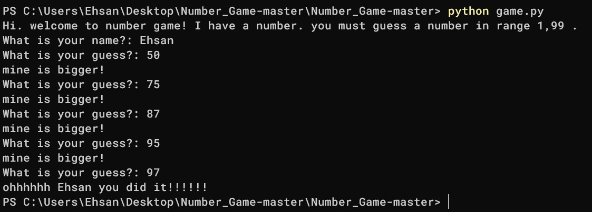

# Number Guessing Game



## 📝 Description
A fun and interactive terminal-based game built with **Python**. The program selects a random number between 1 and 99, and the player must guess it using logic and hints provided by the game.

## ✨ Features
- **Random Number Generation:** Every game is unique thanks to the `random` module.
- **Interactive Logic:** Provides "Bigger" or "Smaller" hints to guide the player.
- **Personalized Experience:** Asks for the player's name and celebrates their victory personally.
- **Simple & Clean:** Lightweight code, perfect for beginners to study Python logic.

## 🛠️ Technologies Used
- **Python 3:** The core programming language.
- **Random Module:** Used for generating the target number.

## 🚀 How to Run

1. **Clone the Repository:**
```bash
git clone [https://github.com/EHSBIZ/Number_Game.git](https://github.com/EHSBIZ/Number_Game.git)
```
2. Run the Game: Make sure you have Python installed, then run:
```bash
python game.py
```
## 🎮 How to Play
1. Enter your name when prompted.
   
2. Type a number between 1 and 99.

3. Read the hints:
   
    -If the program says ```mine is smaller!```, your guess was too high.

    -If it says ```mine is bigger!```, your guess was too low.

4. Keep guessing until you find the magic number!
